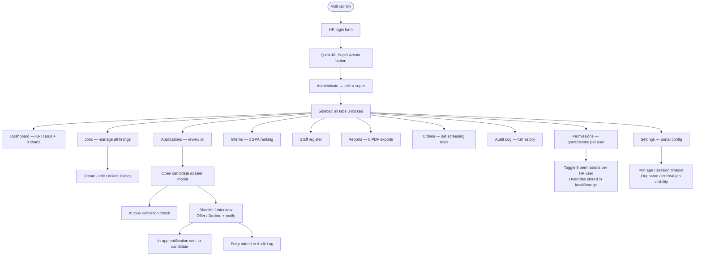
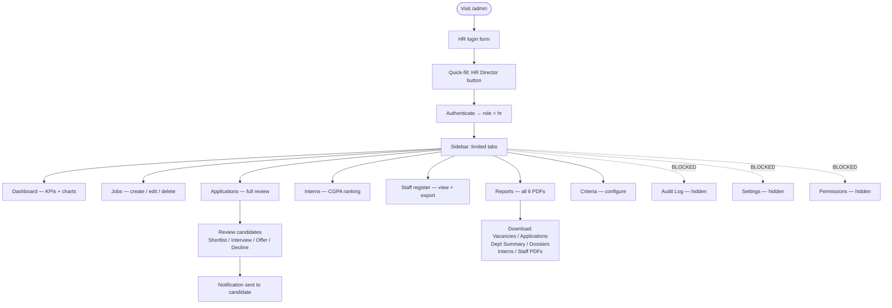
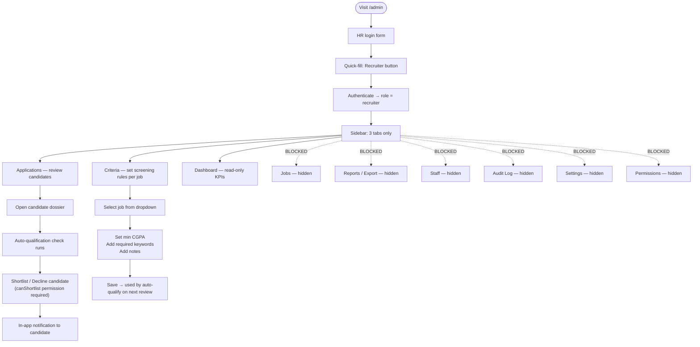
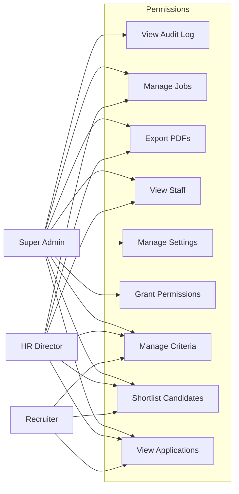

# CAA Uganda e-Recruitment Portal — User Workflow Flowcharts

All diagrams use [Mermaid](https://mermaid.js.org/) syntax. Render them in VS Code (Mermaid Preview extension), GitHub, or any Mermaid-compatible viewer.

---

## Overview — All 5 User Journeys

```mermaid
flowchart TD
    ENTRY([User visits portal]) --> AUTH{Signed in?}

    AUTH -- No --> PUBLIC[Browse jobs / homepage]
    AUTH -- Yes --> ROLE{User role?}

    PUBLIC --> APPLY_PROMPT[Clicks Apply → Sign-in prompt]
    APPLY_PROMPT --> LOGIN_PAGE[/login or /register]
    LOGIN_PAGE --> ROLE

    ROLE -- External Candidate --> EC_FLOW[External Candidate journey]
    ROLE -- Internal CAA Staff --> IC_FLOW[Internal Candidate journey]
    ROLE -- Super Admin --> SA_FLOW[Super Admin journey]
    ROLE -- HR Director --> HD_FLOW[HR Director journey]
    ROLE -- Recruiter --> REC_FLOW[Recruiter journey]
```

---

## 1. External Candidate

Any person registering with a non-`@caa.co.ug` email address.

```mermaid
flowchart TD
    START([Visit portal]) --> HOME[Homepage — hero, search, featured jobs]
    HOME --> BROWSE[/vacancies — External jobs only]
    BROWSE --> JOB_DETAIL[/job?jobId=N — Job detail page]

    JOB_DETAIL --> APPLY_BTN{Click Apply Now}
    APPLY_BTN -- Not signed in --> PROMPT[Sign-in prompt modal]
    PROMPT --> REGISTER[/register — External account]
    REGISTER --> REG_FORM["Email + password\n+ Account type: External"]
    REG_FORM --> LOGIN[/login]
    LOGIN --> APPLY_BTN

    APPLY_BTN -- Signed in --> CV_CHECK{CV already saved?}
    CV_CHECK -- No --> APPLY["/apply?jobId=N — 8-step form"]
    CV_CHECK -- Yes --> REVIEW["Review & Edit saved CV"]
    REVIEW --> APPLY

    APPLY --> STEP0[Step 0: Personal Info]
    STEP0 --> STEP1[Step 1: Qualifications]
    STEP1 --> STEP2[Step 2: Skills]
    STEP2 --> STEP3[Step 3: Work Experience]
    STEP3 --> STEP4[Step 4: Referees ×2 min]
    STEP4 --> STEP5[Step 5: Next of Kin]
    STEP5 --> STEP6[Step 6: Photo upload]
    STEP6 --> STEP7[Step 7: Review & Submit]
    STEP7 --> SUCCESS[Success modal — Reference number issued]

    SUCCESS --> DASH[/dashboard — Candidate dashboard]
    DASH --> STATUS[Track application status]
    DASH --> NOTIF[Read HR notifications]
    DASH --> PDF[Download application PDF]
    DASH --> WITHDRAW[Withdraw application]
```

---

## 2. Internal CAA Staff Candidate

CAA employees with a `@caa.co.ug` email and a valid employee number.

```mermaid
flowchart TD
    START([Visit portal]) --> HOME[Homepage]
    HOME --> BROWSE[/vacancies]
    BROWSE --> INTERNAL_BADGE[Internal access badge shown]
    INTERNAL_BADGE --> ALL_JOBS["Sees ALL jobs:\nExternal + Internal-only listings\n(Operations dept visible)"]

    ALL_JOBS --> JOB_DETAIL[/job?jobId=N]
    JOB_DETAIL --> APPLY_BTN{Apply Now}

    APPLY_BTN -- Not signed in --> REGISTER[/register — Internal account]
    REGISTER --> INT_FORM["@caa.co.ug email\n+ Employee number (CAA-1001/1002/1003)\n+ Password"]
    INT_FORM --> VALIDATED{Employee number\nvalid?}
    VALIDATED -- No --> INT_FORM
    VALIDATED -- Yes --> LOGIN[/login]
    LOGIN --> APPLY_BTN

    APPLY_BTN -- Signed in --> APPLY[/apply?jobId=N — same 8-step form]
    APPLY --> SUBMIT[Submit application]
    SUBMIT --> DASH[/dashboard]
    DASH --> MONITOR["Monitor shortlist / interview\nstatus via notifications"]

    INT_FORM -. "Wrong email domain?" .-> DOWNGRADE["Downgraded to External\n(toast warning — internal jobs hidden)"]
```

---

## 3. Super Admin — Alex Mukasa

Full HR Console access. Credentials: `admin@caa.co.ug` / `Admin@2026`.



---

## 4. HR Director — Jane Mirembe

Broad HR access — cannot touch Audit Log, Settings, or Permissions. Credentials: `hr.director@caa.co.ug` / `HrDir@2026`.



---

## 5. Recruiter — David Ssempala

Minimal access — applications review and criteria setup only. Credentials: `recruit@caa.co.ug` / `Recruit@2026`.



---

## Permission Matrix Summary


